

  

  

  
  
  
  
  

 

## 👋 Sobre mim

Na prática? **Eu ensino máquinas a fazer o trabalho chato.** Sou o cara que mergulha em processos manuais e dados complexos para encontrar a oportunidade perfeita de automatizar tudo com **Python**. Tenho uma base sólida em **Ciência de Dados**, mas meu verdadeiro foco é construir soluções que economizam tempo e entregam inteligência de forma rápida. Adoro a teoria, mas me realizo mesmo quando vejo um script meu rodando e resolvendo um problema real.

<table>
  <tr>
    <td width="50%" valign="top">
      <h4>🔭 O que eu construo no dia a dia</h4>
      Traduzo problemas de negócio em código. Hoje, na <b>Bio Mundo</b>, integro o ERP com o e-commerce, mantenho o Data Warehouse e automatizo a operação com Python e SQL. Também construo APIs com Flask e FastAPI e transformo a bagunça dos dados em dashboards que qualquer gestor entende.
    </td>
    <td width="50%" valign="top">
      <h4>🧠 Minhas ferramentas preferidas</h4>
      Python, SQL e Power BI no dia a dia, domínio no ecossistema SAS (RTDM, ID e Guide), e estou sempre explorando IA Generativa para descobrir novas formas de resolver velhos problemas.
    </td>
  </tr>
  <tr>
    <td width="50%" valign="top">
      <h4>🎓 Minha base</h4>
      Formado em Big Data e Inteligência Analítica e em Ciência de Dados e IA pelo IESB. Acredito que a faculdade te dá as ferramentas; o mercado te ensina a construir de verdade.
    </td>
    <td width="50%" valign="top">
      <h4>🛠️ O que ando estudando</h4>
      Como os sistemas funcionam por dentro. Construí do zero, em Go e TypeScript, um banco de dados, um motor de busca, uma fila de jobs e um editor colaborativo. Estão logo abaixo.
    </td>
  </tr>
</table>

💡 **Bora trocar uma ideia?** Curte automação, web scraping ou transformar dados em produtos de valor? Me chama!

📫 **Contato:** [tassiolucian.ljs@gmail.com](mailto:tassiolucian.ljs@gmail.com) &nbsp;·&nbsp; 📄 **Currículo:** [visualizar](https://drive.google.com/file/d/1H0TI_uiyEgywgleO0LcV580DmFwRguwb/view?usp=sharing) &nbsp;·&nbsp; 😄 **Pronomes:** Ele/Dele

 

## 🧱 Sistemas construídos do zero

  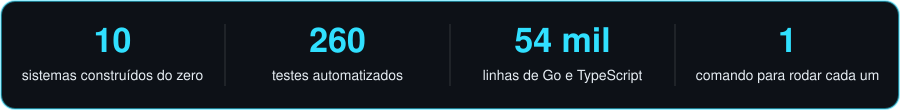

 

Dez projetos em que o miolo foi escrito à mão, sem biblioteca pronta para a parte difícil. Todos rodam com um `run.bat`, têm testes automatizados, números medidos e um README que termina com o que o projeto **não** faz.

#### Bancos de dados e armazenamento

<table>
  <tr>
    <td width="50%"><a href="https://github.com/TassioSales/lume">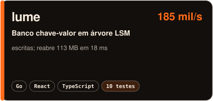</a></td>
    <td width="50%"><a href="https://github.com/TassioSales/busca">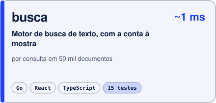</a></td>
  </tr>
  <tr>
    <td width="50%"><a href="https://github.com/TassioSales/razao">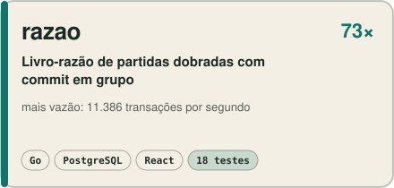</a></td>
    <td width="50%"><a href="https://github.com/TassioSales/plano">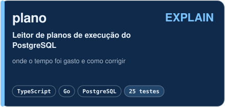</a></td>
  </tr>
</table>

#### Sistemas distribuídos e segurança

<table>
  <tr>
    <td width="50%"><a href="https://github.com/TassioSales/simulacra">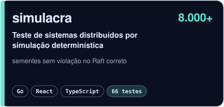</a></td>
    <td width="50%"><a href="https://github.com/TassioSales/fila">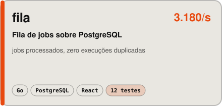</a></td>
  </tr>
  <tr>
    <td width="50%"><a href="https://github.com/TassioSales/trilha">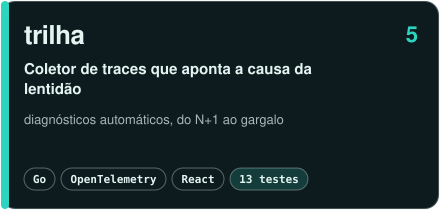</a></td>
    <td width="50%"><a href="https://github.com/TassioSales/cifra">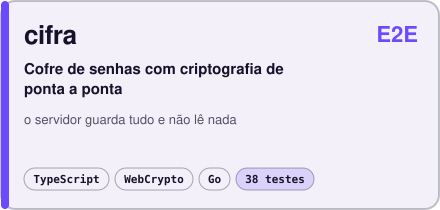</a></td>
  </tr>
</table>

#### Colaboração em tempo real

<table>
  <tr>
    <td width="50%"><a href="https://github.com/TassioSales/pauta">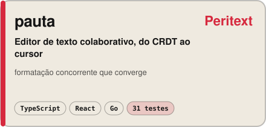</a></td>
    <td width="50%"><a href="https://github.com/TassioSales/mesa">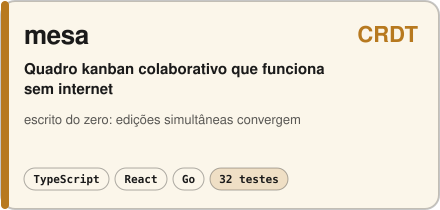</a></td>
  </tr>
</table>

<b>O que cada um demonstra</b>

 

| Projeto | O problema difícil | O que foi feito à mão |
| --- | --- | --- |
| [lume](https://github.com/TassioSales/lume) | Não perder dados quando o processo morre no meio de uma escrita | Log de escrita antecipada, lista de saltos, arquivos ordenados com filtro de Bloom, compactação em níveis |
| [busca](https://github.com/TassioSales/busca) | Achar e ordenar por relevância em milissegundos, tolerando erro de digitação | Índice invertido, BM25, análise de texto em português, correção por trigramas |
| [razao](https://github.com/TassioSales/razao) | Dinheiro que nunca aparece nem some, com vazão alta e escrita durável | Partidas dobradas, escritor único com commit em grupo, histórico encadeado por hash |
| [plano](https://github.com/TassioSales/plano) | Entender por que uma consulta é lenta | Analisador de `EXPLAIN`, diagnósticos, teste de índice em transação desfeita |
| [simulacra](https://github.com/TassioSales/simulacra) | Reproduzir uma falha rara de um sistema distribuído | Simulação determinística de rede, disco e quedas; Raft; verificador de linearizabilidade |
| [fila](https://github.com/TassioSales/fila) | Não perder nem duplicar trabalho quando um worker cai | Reserva com `SKIP LOCKED`, batimento, resgate, retentativas e agendamentos |
| [trilha](https://github.com/TassioSales/trilha) | Achar a causa da lentidão entre vários serviços | Coletor OTLP, árvore de spans, caminho crítico, diagnósticos automáticos |
| [cifra](https://github.com/TassioSales/cifra) | Guardar segredos num servidor que não pode lê-los | Hierarquia de chaves (Argon2id, HKDF, AES-GCM, ECDH), compartilhamento e revogação |
| [pauta](https://github.com/TassioSales/pauta) | Várias pessoas formatando o mesmo texto ao mesmo tempo | CRDT de texto rico, o próprio editor, comentários ancorados, desfazer por pessoa |
| [mesa](https://github.com/TassioSales/mesa) | Colaborar offline sem tela de conflito | CRDTs de texto e de registro, ordenação fracionária, sincronização por vetores de versão |

 

## 🚀 Produto, dados e automação

O repositório [**MeuPortfolio**](https://github.com/TassioSales/MeuPortfolio) reúne **25 projetos** que resolvem um problema específico de ponta a ponta, da coleta do dado à tela que alguém usa, mais as minhas contribuições em código aberto. Três deles estão no ar.

#### Comece por aqui

Seis trabalhos que carregam evidência verificável, não só descrição.

<table>
  <tr>
    <td width="50%"><a href="https://github.com/TassioSales/MeuPortfolio/tree/main/contribuicoes_open_source">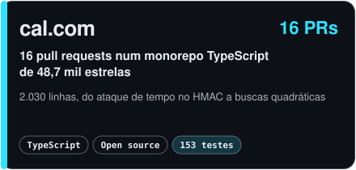</a></td>
    <td width="50%"><a href="https://github.com/TassioSales/MeuPortfolio/tree/main/edge_audit">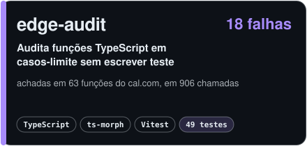</a></td>
  </tr>
  <tr>
    <td width="50%"><a href="https://github.com/TassioSales/MeuPortfolio/tree/main/conciliador_bancario">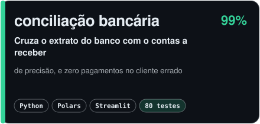</a></td>
    <td width="50%"><a href="https://github.com/TassioSales/MeuPortfolio/tree/main/crm_conversacional">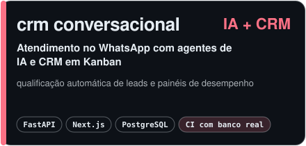</a></td>
  </tr>
  <tr>
    <td width="50%"><a href="https://github.com/TassioSales/MeuPortfolio/tree/main/finan%C3%A7as">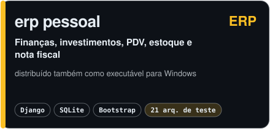</a></td>
    <td width="50%"><a href="https://github.com/TassioSales/MeuPortfolio/tree/main/analise_de_combustiveis">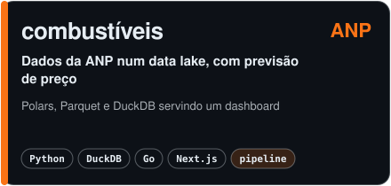</a></td>
  </tr>
</table>

#### No ar agora

<table>
  <tr align="center">
    <td valign="top" width="33%">
      
      <h3>💰 PriceTrack AI</h3>
      Monitor de preço em e-commerce com alerta proativo e análise de mercado por IA generativa.
        
      Python • Streamlit • Gemini • SQLAlchemy
        
      
      
    </td>
    <td valign="top" width="33%">
      
      <h3>🎟 Plataforma de Rifas</h3>
      Gestão completa de rifas e sorteios, com analytics e geração de PDF.
        
      Python • Streamlit • SQLite • Docker
        
      
      
    </td>
    <td valign="top" width="33%">
      
      <h3>🗺 Gerador de Roteiros</h3>
      Roteiros de viagem personalizados, com alternância automática entre dois provedores de IA.
        
      Python • Streamlit • Mistral • Gemini
        
      
      
    </td>
  </tr>
</table>

#### Todos os projetos

<b>📊 Dados e análise</b> (6)

 

| Projeto | O que faz | Tecnologias |
| --- | --- | --- |
| [Análise de Combustíveis](https://github.com/TassioSales/MeuPortfolio/tree/main/analise_de_combustiveis) | Baixa os dados da ANP, processa com Polars, grava em Parquet/DuckDB e serve um dashboard com previsão de preço | Python · DuckDB · Go · Next.js |
| [Panorama BR](https://github.com/TassioSales/MeuPortfolio/tree/main/panorama_br) | Indicadores econômicos brasileiros com coleta automática do Banco Central e do yfinance | Python · Go · Next.js 14 |
| [ENEM Insights](https://github.com/TassioSales/MeuPortfolio/tree/main/enem_insights) | Impacto de renda, escola, região e raça nas notas do ENEM, com modelo preditivo | Python · Streamlit · scikit-learn |
| [DataNarrator](https://github.com/TassioSales/MeuPortfolio/tree/main/data_narrator) | Recebe um CSV ou Excel e devolve a análise exploratória com narrativa gerada por IA e relatório em PDF | Python · Streamlit · Mistral AI |
| [DevMetrics](https://github.com/TassioSales/MeuPortfolio/tree/main/devmetrics) | Métricas de perfil e repositórios do GitHub com leitura automatizada | Go · Next.js · Mistral AI |
| [WealthMap Analytics](https://github.com/TassioSales/MeuPortfolio/tree/main/wealthmap_analytics) | Gestão de carteira com previsão de 30 dias, Sharpe, volatilidade e matriz de correlação | Python · FastAPI · Next.js · scikit-learn |

<b>🤖 IA aplicada</b> (8)

 

| Projeto | O que faz | Tecnologias |
| --- | --- | --- |
| [Nexus](https://github.com/TassioSales/MeuPortfolio/tree/main/nexus) | Terminal de IA com interface TUI que executa ferramentas de verdade em loop ReAct, com sessões persistentes | Python · TUI |
| [MemMap](https://github.com/TassioSales/MeuPortfolio/tree/main/memmap) | Editor de notas que extrai entidades com spaCy e monta um grafo de conhecimento interativo em tempo real | Go · spaCy · D3.js · WebSocket |
| [DocuMind Local](https://github.com/TassioSales/MeuPortfolio/tree/main/documind_local) | Assistente de documentos que roda na própria máquina: upload, extração de texto, busca e análise | Go · Python · Mistral AI |
| [Transcritor WhatsApp](https://github.com/TassioSales/MeuPortfolio/tree/main/transcritor_whatsapp) | Transcreve áudios do WhatsApp offline e cruza com o texto exportado para identificar autor e trechos de interesse | Python · faster-whisper · Streamlit |
| [VoxBR](https://github.com/TassioSales/MeuPortfolio/tree/main/voxbr) | Transcrição de áudio com Whisper e geração de resumo | Python · Whisper · Mistral AI · Next.js |
| [Gerador de Roteiros](https://jiqucdwsimgpjhzzhmn3f2.streamlit.app/) | Roteiros de viagem personalizados, com alternância entre dois provedores de IA. **No ar** | Python · Streamlit · Mistral · Gemini |
| [PriceTrack AI](https://pricetrack-ai.streamlit.app) | Monitor de preço em e-commerce com alerta proativo. **No ar** | Python · Streamlit · Gemini · SQLAlchemy |
| [Bot Telegram](https://github.com/TassioSales/MeuPortfolio/tree/main/bot_telegram) | Bot de produtividade com tarefas, lembretes e respostas por IA | Python · Telegram API · Mistral AI |

<b>🏢 Sistemas de negócio</b> (7)

 

| Projeto | O que faz | Tecnologias |
| --- | --- | --- |
| [Conciliação Bancária](https://github.com/TassioSales/MeuPortfolio/tree/main/conciliador_bancario) | Cruza o extrato do banco com o contas a receber em sete estratégias em cascata; o que não tem evidência fica para revisão | Python · Polars · Streamlit · SQLite |
| [CRM Conversacional](https://github.com/TassioSales/MeuPortfolio/tree/main/crm_conversacional) | Atendimento no WhatsApp com agentes de IA, qualificação de leads, CRM em Kanban e dashboards | FastAPI · Next.js 14 · PostgreSQL 16 · Redis 7 · Docker |
| [ERP Pessoal](https://github.com/TassioSales/MeuPortfolio/tree/main/finan%C3%A7as) | Controle financeiro, investimentos, PDV, estoque e emissão de nota fiscal | Django · SQLite · Bootstrap 5 |
| [CompraBio](https://github.com/TassioSales/MeuPortfolio/tree/main/aprovacao_compras) | Solicitação e aprovação de pedidos de compra com histórico auditável, notificação por e-mail e exportação | Python · Django |
| [Plataforma de Rifas](https://plataforma-rifas-pro.streamlit.app) | Gestão de rifas com analytics e geração de PDF. **No ar** | Python · Streamlit · SQLite · Docker |
| [WhatsApp Suporte](https://github.com/TassioSales/MeuPortfolio/tree/main/whatsapp-sup-master) | Bot que coleta um chamado por fluxo guiado e grava em SQLite, deliberadamente sem IA no caminho | TypeScript · SQLite |
| [Encurtador de URL](https://github.com/TassioSales/MeuPortfolio/tree/main/encurtador_url) | Encurtador com analytics de clique e painel de estatísticas | Go · Next.js · SQLite |

<b>🧪 Código aberto e ferramentas</b> (2)

 

| Projeto | O que faz | Tecnologias |
| --- | --- | --- |
| [Contribuições no cal.com](https://github.com/TassioSales/MeuPortfolio/tree/main/contribuicoes_open_source) | 16 pull requests: comparação de HMAC sujeita a ataque de tempo, bugs de identidade de participante, serialização de log, formatação de moeda e buscas quadráticas | TypeScript |
| [edge-audit](https://github.com/TassioSales/MeuPortfolio/tree/main/edge_audit) | Lê a assinatura de funções TypeScript, gera as entradas hostis que o tipo admite, chama a função e reporta quatro tipos de falha | TypeScript · ts-morph · Vitest |

<b>🎮 Jogos</b> (2)

 

| Projeto | O que faz | Tecnologias |
| --- | --- | --- |
| [Neon Drift](https://github.com/TassioSales/MeuPortfolio/tree/main/neon_drift) | Jogo arcade com backend de configuração e placar global | Go · HTML5 Canvas |
| [Neon Snake](https://github.com/TassioSales/MeuPortfolio/tree/main/neon_snake) | Arcade para um jogador com placar persistido | Go · HTML5 Canvas |

 

## ⚙️ Linguagens e ferramentas

<table>
  <tr>
    <td width="210"><b>Linguagens</b></td>
    <td></td>
  </tr>
  <tr>
    <td><b>Dados e análise</b></td>
    <td>
      
      
      
      
      
      
      
    </td>
  </tr>
  <tr>
    <td><b>BI e decisão em tempo real</b></td>
    <td>
      
      
      
      
    </td>
  </tr>
  <tr>
    <td><b>Backend e APIs</b></td>
    <td></td>
  </tr>
  <tr>
    <td><b>Bancos de dados</b></td>
    <td></td>
  </tr>
  <tr>
    <td><b>Frontend</b></td>
    <td></td>
  </tr>
  <tr>
    <td><b>Infra e dia a dia</b></td>
    <td></td>
  </tr>
</table>

 

## 📊 Estatísticas do GitHub

  
  
   
  
    
  

 

## 💼 Experiência profissional

<table>
  <tr>
    <td width="210" valign="top">
      <b>Bio Mundo</b> 
      ASM Master Franqueadora 📅 Nov/2025 – Atual 📍 Brasília, DF
    </td>
    <td valign="top">
      <i>Analista de TI</i>
      <ul>
        <li>Integro o <b>ERP</b> com a plataforma de <b>e-commerce</b>, mantendo a sincronização de categorias de produtos e dados críticos do site.</li>
        <li>Desenvolvo scripts em <b>Python</b> para automatizar processos operacionais, reduzindo tarefas manuais e aumentando a confiabilidade dos dados.</li>
        <li>Crio e mantenho queries <b>SQL</b> para extração e tratamento de dados que apoiam as decisões da operação.</li>
        <li>Mantenho o <b>Data Warehouse</b> da empresa, centralizando os dados operacionais das unidades.</li>
        <li>Construo relatórios e dashboards de <b>BI</b> para acompanhar os indicadores da rede.</li>
        <li>Cuido da <b>VPN</b> corporativa e monitoro servidores locais e em nuvem, garantindo acesso seguro e disponibilidade para a rede de franqueados.</li>
      </ul>
    </td>
  </tr>
  <tr>
    <td valign="top">
      <b>BRQ Digital Solutions</b> 
      📅 Nov/2023 – Jun/2024 📍 São Paulo, SP
    </td>
    <td valign="top">
      <i>Analista de BI Pleno • Cientista de Dados • Programador Python</i>
      <ul>
        <li>Desenvolvi automações em <b>Python</b> para integrar múltiplas fontes de dados, reduzindo em <b>20%</b> o tempo de processamento.</li>
        <li>Realizei análises preditivas com <b>SAS ID</b>, aumentando a precisão das previsões operacionais e otimizando a alocação de recursos.</li>
        <li>Automatizei consultas <b>SQL</b> e rotinas de extração, acelerando em <b>25%</b> a geração de relatórios críticos.</li>
      </ul>
    </td>
  </tr>
  <tr>
    <td valign="top">
      <b>K2 Partners</b> 
      📅 Jan/2023 – Set/2023 📍 São Paulo, SP
    </td>
    <td valign="top">
      <i>Analista de Desenvolvimento de Sistemas • Cientista de Dados</i>
      <ul>
        <li>Modelei processos de coleta e tratamento de dados com <b>Python</b> e <b>SQL</b>, garantindo consistência e confiabilidade das análises.</li>
        <li>Implementei sistemas de resposta em tempo real com <b>SAS RTDM</b>, possibilitando ajustes imediatos nas estratégias de marketing e vendas.</li>
        <li>Automatizei tarefas repetitivas com <b>Python</b>, aumentando a produtividade da equipe em <b>25%</b>.</li>
      </ul>
    </td>
  </tr>
  <tr>
    <td valign="top">
      <b>iBlue Consulting</b> 
      📅 Abr/2021 – Dez/2022 📍 Rio de Janeiro, RJ
    </td>
    <td valign="top">
      <i>Analista de Desenvolvimento de Sistemas</i>
      <ul>
        <li>Desenvolvi sistemas de resposta em tempo real com <b>Python</b>, reduzindo em <b>30%</b> o tempo de entrega de análises críticas.</li>
        <li>Criei e mantive rotinas de integração de dados, assegurando a consistência das informações usadas pela liderança.</li>
        <li>Automatizei consultas SQL e desenvolvi dashboards dinâmicos no <b>Power BI</b>, dando visibilidade clara aos principais KPIs.</li>
      </ul>
    </td>
  </tr>
  <tr>
    <td valign="top">
      <b>Procuradoria-Geral da Fazenda Nacional (PGFN)</b> 
      📅 Fev/2019 – Abr/2021 📍 Brasília, DF
    </td>
    <td valign="top">
      <i>Estágio – Cientista de Dados</i>
      <ul>
        <li>Desenvolvi notebooks em <b>Python</b> para automação da coleta e limpeza de dados, otimizando os fluxos internos.</li>
        <li>Auxiliei na criação de modelos analíticos que identificaram padrões históricos e apoiaram previsões e decisões gerenciais.</li>
        <li>Automatizei relatórios recorrentes, ampliando a capacidade de análise da equipe e reduzindo o retrabalho.</li>
      </ul>
    </td>
  </tr>
</table>

 

## 📚 Formação acadêmica

<table>
  <tr>
    <td width="210" valign="top">
      <b>Tecnólogo em Big Data e Inteligência Analítica (EAD)</b> 
      📅 Mar/2023 – Dez/2025 📍 IESB, Brasília
    </td>
    <td valign="top">
      <ul>
        <li>Projeto integrador: pipeline de dados em 🐍 <b>Python</b> para análise de gastos parlamentares, com modelagem em <b>star schema</b> e integração via API de dados abertos.</li>
        <li>Aplicação prática de 🧠 <b>Machine Learning</b>, análise exploratória e visualização ao longo de projetos reais do curso.</li>
        <li>Experiência com ⚡ <b>Apache Spark</b>, 🐘 <b>Hadoop</b>, ☁️ <b>AWS</b>, 📈 <b>R</b> e 📊 <b>SAS</b>.</li>
      </ul>
    </td>
  </tr>
  <tr>
    <td valign="top">
      <b>Bacharelado em Ciência de Dados e Inteligência Artificial</b> 
      📅 Ago/2019 – Dez/2023 📍 IESB, Brasília
    </td>
    <td valign="top">
      <ul>
        <li>Base em ➕ <b>matemática</b>, 📊 <b>estatística</b>, 💻 <b>programação</b> e <b>Machine Learning</b>, com ênfase na aplicação de algoritmos de IA em dados estruturados e não estruturados.</li>
        <li>Projetos práticos de análise exploratória, visualização de dados e modelagem preditiva.</li>
      </ul>
    </td>
  </tr>
</table>

 

## 📜 Certificações

<b>🏆 Desenvolvimento Python</b> (6)

 

- **Python** - Focado em classes, objetos e os pilares da programação orientada a objetos (POO) aplicados em Python.
- **Desenvolvimento Orientado a Objetos Utilizando a Linguagem Python** - Aprofundamento em POO aplicada em Python.
- **Python para Data Science** - Utilização de bibliotecas como Pandas, NumPy e Matplotlib para análise, manipulação e visualização de dados.
- **Linguagem de Programação Python - Básico** - Curso introdutório sobre a sintaxe, estruturas de dados e conceitos fundamentais.
- **Python Orientação a Objetos** - Focado em classes, objetos e os pilares da programação orientada a objetos.
- **Criando um Projeto com Interface Gráfica Utilizando a Linguagem Python** - Desenvolvimento de aplicações desktop com interfaces gráficas (GUI) utilizando Tkinter.

<b>📊 Análise de Dados com SAS</b> (6)

 

- **SAS Programming 1: Essentials** - Introdução à programação SAS, cobrindo leitura de dados, manipulação básica e geração de relatórios.
- **SAS Programming 2: Data Manipulation Techniques** - Técnicas para manipulação de dados em SAS, incluindo junção de tabelas, funções e processamento condicional.
- **SAS Programming 3: Advanced Techniques** - Tópicos avançados de programação SAS, focados em otimização de código, macros e técnicas eficientes de processamento.
- **SAS SQL 1: Essentials** - Fundamentos do uso de SQL dentro do ambiente SAS para realizar consultas, filtros e junções de dados.
- **SAS Real-Time Decision Manager: Creating Resources for Inbound Campaigns** - Criação de campanhas de marketing e regras de decisão em tempo real.
- **Managing and Using the SAS® Customer Intelligence Common Data Model** - Gerenciamento e utilização do modelo de dados do SAS Customer Intelligence para análises de clientes.

<b>🛠️ Ferramentas e Metodologias</b> (2)

 

- **Git e GitHub** - Sistema de controle de versão Git e plataforma GitHub para gerenciamento de código e projetos colaborativos.
- **Scrum: Framework Ágil para Gestão de Projetos** - Capacitação no framework Scrum, abrangendo papéis, eventos e artefatos para gestão ágil de projetos.

 

## 📱 Contatos e redes sociais

  
  
  
  
  

 

<picture>
  <source media="(prefers-color-scheme: dark)" srcset="https://raw.githubusercontent.com/TassioSales/TassioSales/output/pacman-contribution-graph-dark.svg">
  <source media="(prefers-color-scheme: light)" srcset="https://raw.githubusercontent.com/TassioSales/TassioSales/output/pacman-contribution-graph.svg">
  
</picture>

  

